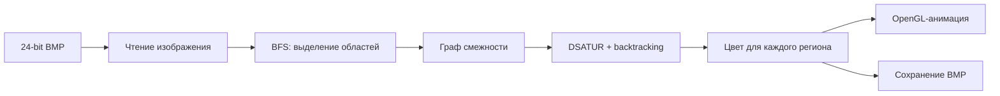

# Map Coloring with DSATUR

[](https://github.com/itzTrickster/map-coloring-dsatur/actions/workflows/core.yml)

Программа на C для раскраски карт, представленных 24-битными BMP-изображениями. Она выделяет области карты, строит граф смежности и раскрашивает его алгоритмом DSATUR с backtracking. Есть графический режим на OpenGL и отдельный CLI-режим.


## Возможности

- чтение и запись 24-битных BMP без сжатия;
- выделение связных областей методом BFS;
- построение графа смежности по общим чёрным границам;
- раскраска графа алгоритмом DSATUR с backtracking;
- попытка уложиться в 4 цвета с fallback до 5 цветов;
- пошаговая анимация раскраски;
- перемещение и масштабирование карты;
- сохранение раскрашенной карты в BMP;
- GUI и CLI режимы;
- вывод прогресса, числа цветов и времени работы.

## Как это работает



Каждая связная область карты становится вершиной графа. Если две области имеют общую границу, между соответствующими вершинами добавляется ребро. DSATUR выбирает следующую вершину по максимальной насыщенности, то есть по количеству разных цветов у уже раскрашенных соседей. При равной насыщенности приоритет получает вершина с большей степенью.

## Структура проекта

```text
.
├── src/
│   ├── mapread.c               # точка входа GUI и CLI
│   ├── mapread_state.inc       # состояние приложения и UI helpers
│   ├── mapread_io.inc          # загрузка, сохранение и работа с текстурами
│   ├── mapread_coloring.inc    # запуск раскраски, анимация и CLI
│   ├── mapread_frontend.inc    # OpenGL окно и обработка ввода
│   ├── bmp.c                   # чтение и запись BMP
│   ├── graph.c                 # BFS и построение графа смежности
│   └── dsatur.c                # DSATUR и backtracking
├── include/
│   ├── bmp.h
│   ├── graph.h
│   └── dsatur.h
├── tests/
│   └── test_core.c             # тесты основных модулей
├── tools/
│   └── make_sample.py          # генератор небольшой тестовой карты
├── docs/
│   └── demo.svg
├── CMakeLists.txt
└── vcpkg.json
```

`mapread.c` разбит на несколько `.inc` файлов только по зонам ответственности. При сборке они включаются в одну translation unit, поэтому логика приложения остаётся общей, а основной файл не превращается в большой монолит.

## Требования

Для полной версии с GUI:

- Windows 10 или Windows 11;
- Visual Studio 2022 или Build Tools с MSVC;
- CMake 3.24+;
- vcpkg;
- OpenGL 3.3+.

`GLEW` и `GLFW` указаны в `vcpkg.json`.

## Сборка на Windows

```powershell
git clone https://github.com/itzTrickster/map-coloring-dsatur.git
cd map-coloring-dsatur

cmake -S . -B build -DCMAKE_TOOLCHAIN_FILE="$env:VCPKG_ROOT\scripts\buildsystems\vcpkg.cmake"
cmake --build build --config Release
```

При использовании генератора Visual Studio готовый файл обычно будет здесь:

```text
build\Release\map_coloring.exe
```

## Тестовая карта

В репозиторий не добавлен большой набор исходных карт. Для быстрой проверки можно создать небольшую BMP-карту локально:

```powershell
python .\tools\make_sample.py
```

После этого появится:

```text
samples\map1.bmp
```

## Запуск

### GUI

```powershell
.\build\Release\map_coloring.exe
```

В окне можно выбрать BMP-файл и запустить раскраску.

Управление картой:

- `WASD` или стрелки: перемещение;
- `+` и `-`: масштаб;
- `R`: сброс положения и масштаба.

### CLI

Сначала создайте тестовую карту командой выше, затем:

```powershell
.\build\Release\map_coloring.exe .\samples\map1.bmp .\colored.bmp
```

Справка:

```powershell
.\build\Release\map_coloring.exe --help
```

CLI выводит прогресс, количество использованных цветов, общее время и отдельно время работы алгоритма раскраски.

## Тесты

Основные модули `bmp`, `graph` и `dsatur` не зависят от Windows GUI и тестируются отдельно:

```bash
cmake -S . -B build -DBUILD_TESTING=ON
cmake --build build
ctest --test-dir build --output-on-failure
```

Эта же проверка запускается в GitHub Actions при push и pull request.

## Ограничения

- входной файл должен быть 24-битным BMP без сжатия;
- чёрные пиксели считаются границами областей;
- GUI использует WinAPI/GDI и предназначен для Windows;
- матрица смежности ограничена 64 МБ;
- алгоритм использует не более 5 цветов.

## Авторы

Денис Нифантьев, Роман Копеин, 2026.
