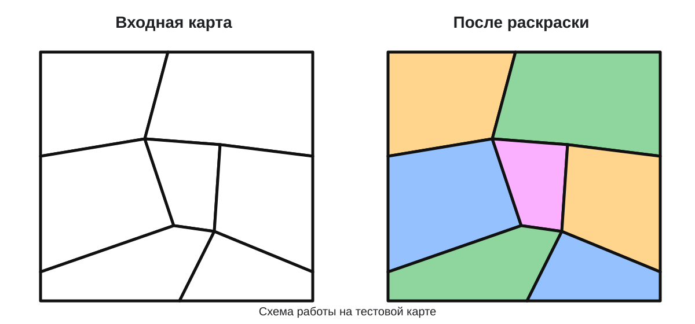
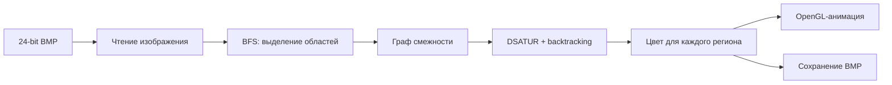

# Map Coloring with DSATUR

[](https://github.com/itzTrickster/map-coloring-dsatur/actions/workflows/core.yml)
[](https://github.com/itzTrickster/map-coloring-dsatur/actions/workflows/windows.yml)

Программа на C для раскраски карт, представленных 24-битными BMP-изображениями. Она выделяет области карты, строит граф смежности и раскрашивает его алгоритмом DSATUR с backtracking. Есть графический режим на OpenGL и отдельный CLI-режим.

Репозиторий содержит только программу раскраски карты и технические файлы, необходимые для сборки и проверки. Отчёт по курсовой работе и остальные учебные материалы сюда не входят.



## Возможности

- чтение и запись 24-битных BMP без сжатия;
- выделение связных областей методом BFS;
- построение графа смежности по общим чёрным границам;
- раскраска графа алгоритмом DSATUR с backtracking;
- попытка уложиться в 4 цвета с fallback до 5 цветов;
- пошаговая анимация раскраски;
- перемещение и масштабирование карты;
- сохранение раскрашенной карты в BMP;
- GUI и CLI режимы;
- вывод прогресса, числа цветов и времени работы.

## Как это работает



Каждая связная область карты становится вершиной графа. Если две области имеют общую границу, между соответствующими вершинами добавляется ребро. DSATUR выбирает следующую вершину по максимальной насыщенности, то есть по количеству разных цветов у уже раскрашенных соседей. При равной насыщенности приоритет получает вершина с большей степенью.

Сначала алгоритм ищет раскраску максимум в 4 цвета. Если решение не найдено, запускается повторный поиск с ограничением в 5 цветов. Если и он не даёт решения, функция раскраски возвращает ошибку.

## Структура проекта

```text
.
├── .github/workflows/
│   ├── core.yml                # GCC, Clang, ASan и UBSan
│   └── windows.yml             # полная сборка GUI и CLI smoke test
├── src/
│   ├── mapread.c               # точка входа GUI и CLI
│   ├── mapread_state.inc       # состояние приложения и UI helpers
│   ├── mapread_io.inc          # загрузка, сохранение и работа с текстурами
│   ├── mapread_coloring.inc    # запуск раскраски, анимация и CLI
│   ├── mapread_frontend.inc    # OpenGL окно и обработка ввода
│   ├── bmp.c                   # чтение и запись BMP
│   ├── graph.c                 # BFS и построение графа смежности
│   └── dsatur.c                # DSATUR и backtracking
├── include/
│   ├── bmp.h
│   ├── graph.h
│   └── dsatur.h
├── tests/
│   └── test_core.c             # тесты основных модулей
├── tools/
│   └── make_sample.py          # генератор небольшой тестовой карты
├── docs/
│   └── demo.svg
├── .editorconfig
├── CMakeLists.txt
└── vcpkg.json
```

`mapread.c` разбит на несколько `.inc` файлов по зонам ответственности. При сборке они включаются в одну translation unit, поэтому логика приложения остаётся общей, а основной файл не превращается в большой монолит.

## Требования

Для полной версии с GUI:

- Windows 10 или Windows 11;
- Visual Studio 2022 или Build Tools с MSVC;
- CMake 3.24+;
- vcpkg;
- OpenGL 3.3+.

`GLEW` и `GLFW` указаны в `vcpkg.json`.

## Сборка на Windows

```powershell
git clone https://github.com/itzTrickster/map-coloring-dsatur.git
cd map-coloring-dsatur

cmake -S . -B build -DCMAKE_TOOLCHAIN_FILE="$env:VCPKG_ROOT\scripts\buildsystems\vcpkg.cmake"
cmake --build build --config Release
```

При использовании генератора Visual Studio готовый файл обычно будет здесь:

```text
build\Release\map_coloring.exe
```

Если `VCPKG_ROOT` не задан, вместо него можно передать полный путь к `scripts\buildsystems\vcpkg.cmake`.

## Тестовая карта

Большой набор исходных карт в репозиторий не добавлен. Для быстрой проверки можно создать небольшую BMP-карту локально:

```powershell
python .\tools\make_sample.py
```

После этого появится:

```text
samples\map1.bmp
```

Каталог с сгенерированными BMP добавлен в `.gitignore`, поэтому тестовая карта не попадёт в коммит случайно.

## Запуск

### GUI

```powershell
.\build\Release\map_coloring.exe
```

В окне можно выбрать BMP-файл и запустить раскраску.

Управление картой:

- `WASD` или стрелки: перемещение;
- `+` и `-`: масштаб;
- `R`: сброс положения и масштаба.

### CLI

Сначала создайте тестовую карту командой выше, затем:

```powershell
.\build\Release\map_coloring.exe .\samples\map1.bmp .\colored.bmp
```

Справка:

```powershell
.\build\Release\map_coloring.exe --help
```

CLI выводит прогресс, количество использованных цветов, общее время и отдельно время работы алгоритма раскраски.

## Тесты

Основные модули `bmp`, `graph` и `dsatur` можно собирать и тестировать отдельно от Windows GUI:

```bash
cmake -S . -B build \
  -DBUILD_TESTING=ON \
  -DMAP_COLORING_BUILD_GUI=OFF
cmake --build build
ctest --test-dir build --output-on-failure
```

Тесты проверяют:

- DSATUR на полном графе K4;
- fallback до 5 цветов на K5;
- корректный отказ для K6 при лимите в 5 цветов;
- построение графа смежности по BMP-подобному изображению;
- запись и повторное чтение BMP;
- обработку отсутствующего BMP-файла.

## Автоматические проверки

При pull request и после изменений в `main` GitHub Actions выполняет несколько независимых проверок:

- сборка core-модулей GCC на Linux с `-Wall -Wextra -Wpedantic -Werror`;
- сборка core-модулей Clang с теми же строгими предупреждениями;
- тесты под AddressSanitizer и UndefinedBehaviorSanitizer;
- полная Windows-сборка GUI через MSVC, OpenGL, GLEW, GLFW и vcpkg;
- запуск core-тестов на Windows;
- end-to-end CLI smoke test: генерация BMP, запуск программы и проверка выходного файла.

Workflows используют минимальные read-only permissions, отменяют устаревшие запуски для той же ветки и имеют явные таймауты.

Локально строгий режим можно включить так:

```bash
cmake -S . -B build \
  -DBUILD_TESTING=ON \
  -DMAP_COLORING_BUILD_GUI=OFF \
  -DMAP_COLORING_WARNINGS_AS_ERRORS=ON
```

Для GCC и Clang можно дополнительно включить санитайзеры:

```bash
cmake -S . -B build-sanitized \
  -DBUILD_TESTING=ON \
  -DMAP_COLORING_BUILD_GUI=OFF \
  -DMAP_COLORING_ENABLE_SANITIZERS=ON
cmake --build build-sanitized
ctest --test-dir build-sanitized --output-on-failure
```

## Ограничения

- входной файл должен быть 24-битным BMP без сжатия;
- чёрные пиксели считаются границами областей;
- GUI использует WinAPI/GDI и предназначен для Windows;
- матрица смежности ограничена 64 МБ;
- алгоритм использует не более 5 цветов.

## Авторы

Денис Нифантьев, Роман Копеин, 2025.
