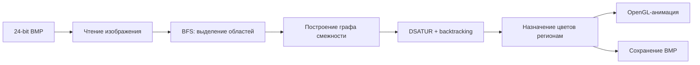

# Map Coloring with DSATUR

Программа на C для раскраски карт, представленных 24-битными BMP-изображениями. Приложение выделяет области карты, строит граф смежности и раскрашивает его алгоритмом DSATUR с backtracking. Для просмотра результата есть графический интерфейс на OpenGL, для автоматического запуска есть CLI-режим.


## Что умеет программа

- читает 24-битные BMP без сжатия;
- выделяет связные области с помощью BFS;
- строит граф смежности по общим чёрным границам;
- раскрашивает граф алгоритмом DSATUR;
- сначала пытается использовать 4 цвета, при необходимости допускает 5-й цвет;
- показывает пошаговую анимацию раскраски;
- поддерживает перемещение и масштабирование карты;
- сохраняет раскрашенную карту в BMP;
- работает как через GUI, так и через командную строку;
- выводит количество цветов, прогресс и время работы алгоритма.

## Как это работает



Карта рассматривается как граф. Каждая связная область становится вершиной, общая граница между двумя областями становится ребром. При выборе следующей вершины DSATUR учитывает насыщенность, то есть количество разных цветов у уже раскрашенных соседей. При равной насыщенности выбирается вершина с большей степенью.

## Структура проекта

```text
.
├── src/
│   ├── mapread.c      # GUI, CLI, OpenGL и управление приложением
│   ├── bmp.c          # чтение и запись BMP
│   ├── graph.c        # BFS и построение графа смежности
│   └── dsatur.c       # DSATUR и backtracking
├── include/
│   ├── bmp.h
│   ├── graph.h
│   └── dsatur.h
├── samples/
│   └── map1.bmp       # пример входной карты
├── tests/
│   └── test_core.c    # тесты основных модулей
├── docs/
│   └── demo.png
├── CMakeLists.txt
└── vcpkg.json
```

## Требования

Для полной версии с GUI:

- Windows 10 или Windows 11;
- Visual Studio 2022 или Build Tools с компилятором MSVC;
- CMake 3.24+;
- vcpkg;
- OpenGL 3.3+.

Зависимости `GLEW` и `GLFW` описаны в `vcpkg.json`.

## Сборка на Windows

В PowerShell:

```powershell
git clone https://github.com/itzTrickster/map-coloring-dsatur.git
cd map-coloring-dsatur

cmake -S . -B build -DCMAKE_TOOLCHAIN_FILE="$env:VCPKG_ROOT\scripts\buildsystems\vcpkg.cmake"
cmake --build build --config Release
```

После сборки исполняемый файл будет находиться в каталоге `build/Release` для генератора Visual Studio.

## Запуск

### Графический режим

```powershell
.\build\Release\map_coloring.exe
```

В окне можно выбрать BMP-файл, запустить раскраску и наблюдать процесс по регионам.

Управление картой:

- `WASD` или стрелки: перемещение;
- `+` и `-`: масштаб;
- `R`: сброс положения и масштаба.

### Командная строка

```powershell
.\build\Release\map_coloring.exe .\samples\map1.bmp .\colored.bmp
```

Справка:

```powershell
.\build\Release\map_coloring.exe --help
```

CLI выводит прогресс, количество использованных цветов, общее время и время работы алгоритма раскраски.

## Тесты

Основные модули `bmp`, `graph` и `dsatur` не зависят от Windows GUI и проверяются отдельно:

```bash
cmake -S . -B build -DBUILD_TESTING=ON
cmake --build build
ctest --test-dir build --output-on-failure
```

GitHub Actions запускает эти проверки при push и pull request.

## Ограничения

- входной файл должен быть 24-битным BMP без сжатия;
- чёрные пиксели считаются границами регионов;
- GUI использует WinAPI/GDI и собирается только на Windows;
- матрица смежности ограничена 64 МБ, чтобы не допускать неконтролируемого расхода памяти;
- алгоритм ограничен пятью цветами.

## Авторы

Денис Нифантьев, Роман Копеин, 2026.
